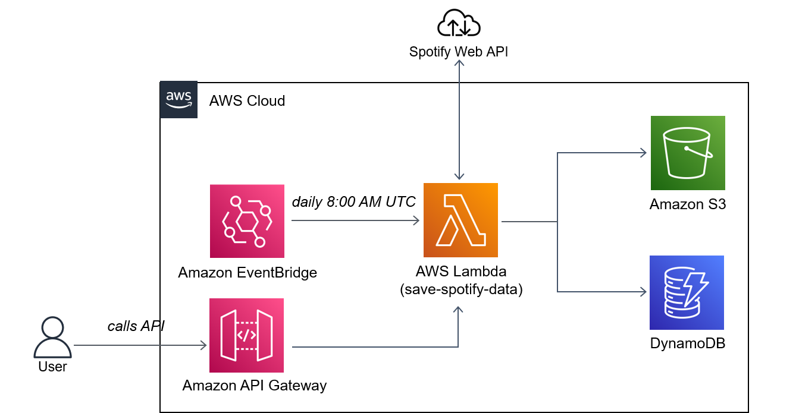

# Save Spotify data using AWS CDK

This project showcases the use of AWS CDK for automatically deploying a stack of services that essentially query an API, transform the returned data and save it into two data separate sinks: an S3 bucket and an DynamoDB table.
All pieces of infrastructure and the entire logic are defined within the project.

It was built using Python 3.9.9 on Windows 10.

## Description

What the stack does is setting up a Lambda function, linking it with an API Gateway for on demand execution and scheduling it to be executed once a day at 8 AM UTC via an EventBridge event. 
It also sets up the S3 bucket and DynamoDB table to store the data.
The Lambda runs Python 3.8 and uses the Layer ```arn:aws:lambda:us-east-1:336392948345:layer:AWSDataWrangler-Python38:1``` supplied by AWS for its libraries.
What the Lambda function does is querying the Spotify Web API for current data about a list of artists (see Configuration). For each artist it will do the following: 
- Query the Spotify API for the Spotify artist ID corresponding to the artist name 
- Query the API again for the 10 most popular tracks of the artist at the time as defined by the Spotify popularity score
- Save the returned data as JSON in an S3 bucket (```top_tracks_{artist_name}_YYYY-mm-dd.json"```)
    - All files are saved in a subdirectory called ```/history```
- Save the returned data in an DynamoDB table a) as is and b) in a reduced format with only the most important information (track names, popularity scores)
    - The table has a Partition Key on the artist_name and a Sort Key on the date in YYYY-mm-dd format. The other information is saved in three attributes called artist_id, top_tracks and top_tracks_main_info.



## Running it

To deploy the app you can follow the instructions laid out in the official AWS CDK examples repo: https://github.com/aws-samples/aws-cdk-examples/tree/master/python
But here I also list the steps and added some details relevant to this specific project:
- Make sure you have AWS CLI installed on your machine and already linked it to your AWS account using an account with sufficient permissions: ```aws --version```
- Ensure CDK is installed: ```npm install -g aws-cdk```
- Create a Python virtual environment: ```python3 -m venv .venv```
- Activate virtual environment
    - On MacOS or Linux: ```source .venv/bin/activate```
    - On Windows: ```.venv\Scripts\activate.bat```
- Install the required dependencies: ```pip install -r requirements.txt```
- Get Spotify credentials and edit the settings file (see below)
- Synthesize (`cdk synth`) or deploy (`cdk deploy`) the example: ```cdk deploy```

## Configuration

Critically you will need to get Spotify Web API credentials before you deploy the stack. You will need both the Client ID and Client Secret (https://developer.spotify.com/documentation/web-api/)
There are two files to configure:
- Follow the instructions in ```./settings/spotify_settings_template.py```. Here you will set the ```CLIENT_ID``` and ```CLIENT_SECRET```.
- Type in some artists that interest you in ```./lambda_save_spotify_data/config/artists.csv```. It's pre-configured with 10 popular artists. The lambda function will first call the API to get their Spotify artist ID and subsequently query it for more data. It's important to note that the first artist ID returned will be used. So in case there are two artists with the same name and you are interested in the less popular one, this won't work. It's a rather quick change but you would need to refactor the code to manually specify the Spotify artist ID instead of the artist name in plain human language.

## Dispose of the stack afterwards

```$ cdk destroy```

## Cost

This is a serverless stack and running it is almost entirely within the Always Free tier.
The only part that will definitely cost you money is the caching used in the Lambda function. At the time of this writing it would cost you about $0.05/12 = $0.004 per each 5 minute interval within which you call the function.

To make it completely free (as long as you're also otherwise remain within Always Free usage limits) comment out the deploy_options defined within the SaveSpotifyDataCdkStack in ```./lambda_save_spotify_data/config/artists.csv```. This will switch off the caching.